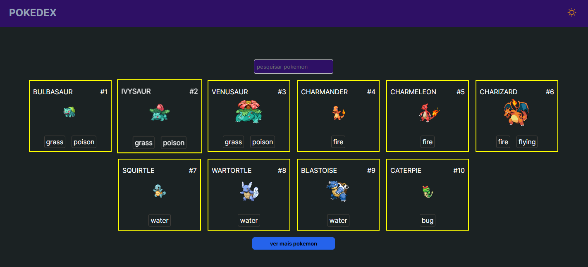
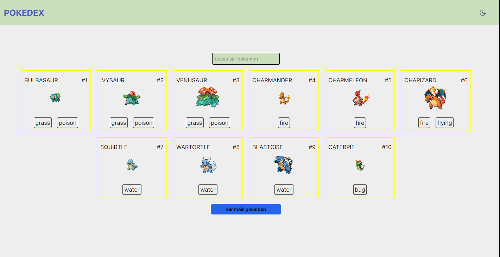
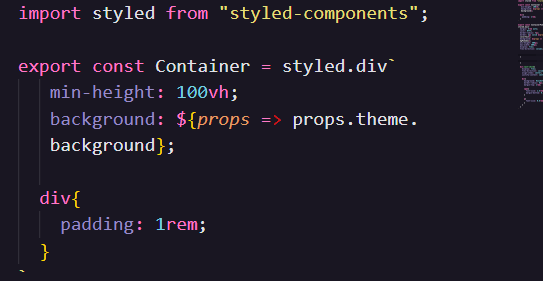
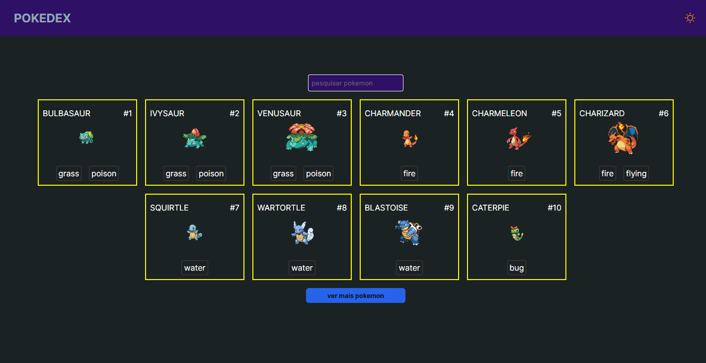
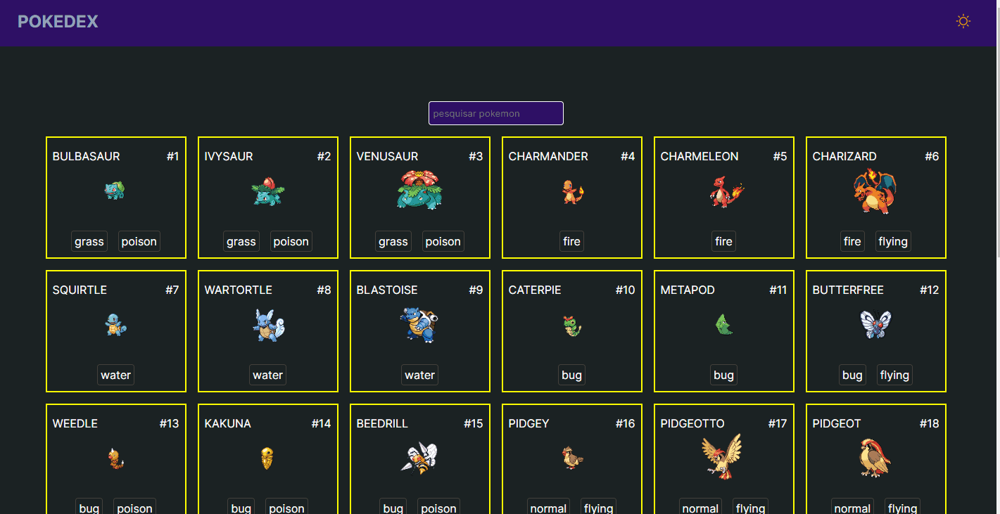
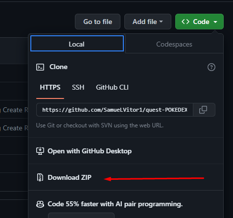

# Projeto Pokedex
Esse desafio faz parte do curso DevQuest, ele serve para simular um teste técnico, passando demadas e requisitos que devem ser implementados e seguidos durante a codificação. 

### Aplicação🕹️:
  
  <a href="https://quest-pokedex.vercel.app/">Link do deploy</a>

### Funcionalidades ⚙️
  Para a construção dessa aplicação utilizamos a api pública do pokemon (pokeapi) 

  Algumas funcionalidades da aplicação:
  - Mudança de tema utilizando context api 
  

  - Para a estilização da aplicação foi utilizada o styled-components
  

  - Renderização de mais pokemons
  
  
  - Exibir mais detalhes do pokemon
  

  Ferramentas utilizadas🛠️:
  - ReactJS : para construção da aplicação como todo
  - styled-components : para estilização
  - react-router-dom : para navegação entre as páginas
  - Context Api: criação do theme toggler (mudança de tema)

## Instalação 📦
 <p>
  Para instalar o projeto no seu computador vai precisar: 
  </p>
  <li>Baixar o projeto:</li>
   <br> <br>

  <li>Extrai a pasta baixada do projeto e dentro dela abre o prompt </li> <br>

   <li>Agora vamos instalar as dependências do projeto, para isso podemos usar gerenciador de pacotes NPM</li> <br>
  <p>Para instalar as dependências do projeto rodamos o seguinte comando:</p>
</ol>

  ```sh
    npm install
